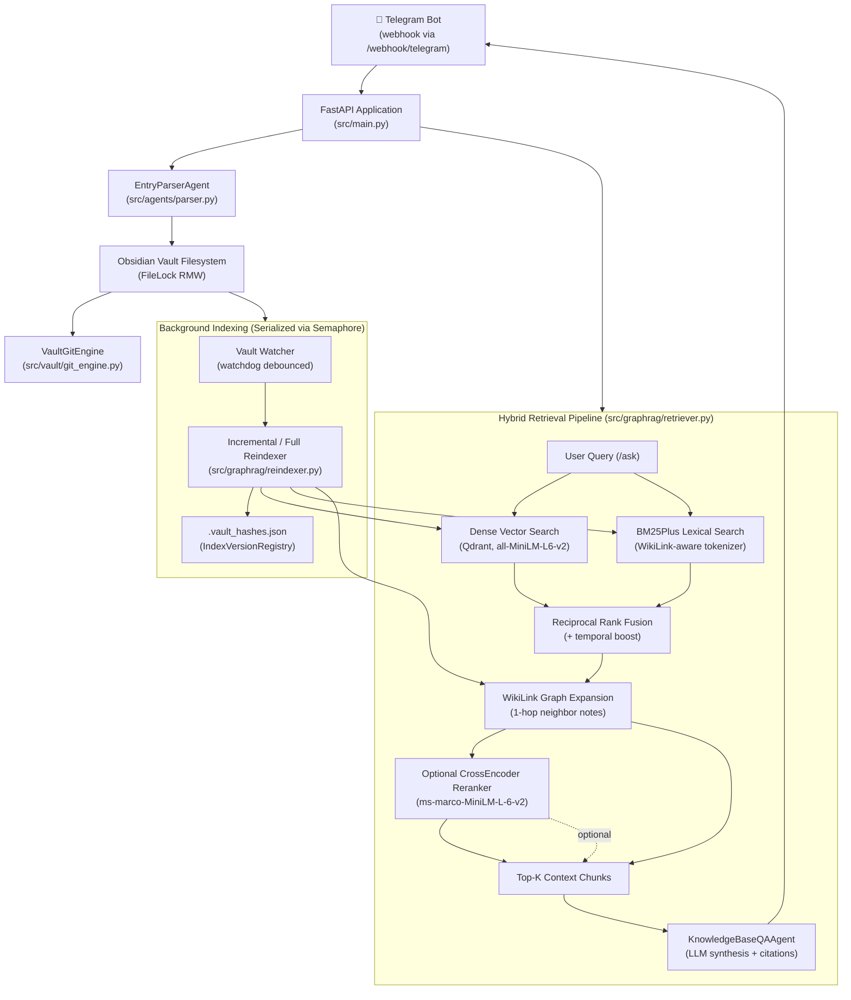

# PKM AI Agent — Second Brain via Telegram

**An AI-powered personal knowledge management agent that turns your Obsidian vault into a queryable, self-organizing knowledge base — controlled entirely through Telegram.**

[](https://www.python.org/downloads/)
[](https://fastapi.tiangolo.com/)
[](#testing)
[](LICENSE)

> **Status:** Personal production project / active development.
> The default configuration is optimized for a small single-worker deployment (2 vCPU / 4 GB RAM target). Retrieval and memory characteristics should be evaluated against your own vault before increasing concurrency or enabling optional ML components.

---


## 📑 Table of Contents

- [Why I Built This](#why-i-built-this)
- [What It Demonstrates](#what-it-demonstrates)
- [Tech Stack](#tech-stack)
- [Key Features](#key-features)
- [Architecture Overview](#architecture-overview)
- [Obsidian Vault & Git Setup](#obsidian-vault--git-setup)
- [Prerequisites](#prerequisites)
- [Installation](#installation)
- [Configuration](#configuration)
  - [Required Settings](#required-settings)
  - [Optional Core Settings](#optional-core-settings)
  - [Retrieval Pipeline Settings](#retrieval-pipeline-settings)
  - [Audio Transcription Settings](#audio-transcription-settings)
  - [Scheduling & Automation Settings](#scheduling--automation-settings)
  - [Concurrency & Resource Limits](#concurrency--resource-limits)
- [Usage](#usage)
  - [Starting the Application](#starting-the-application)
  - [CLI Commands](#cli-commands)
  - [Telegram Bot Commands](#telegram-bot-commands)
  - [Webhook Setup](#webhook-setup)
  - [REST API Endpoints](#rest-api-endpoints)
- [Retrieval Evaluation](#retrieval-evaluation)
- [Deployment](#deployment)
  - [Hosting Profile & Architectural Principles](#hosting-profile--architectural-principles)
  - [Step-by-Step Cloud VPS Deployment Guide](#step-by-step-cloud-vps-deployment-guide)
  - [Process Supervision (systemd)](#process-supervision-systemd)
  - [Reverse Proxy & HTTPS Setup](#reverse-proxy--https-setup)
  - [Telegram Webhook Activation & Verification](#telegram-webhook-activation--verification)
  - [Production Operations & Maintenance](#production-operations--maintenance)
- [Current Limitations](#current-limitations)
- [Important Notes & Gotchas](#important-notes--gotchas)
- [Testing](#testing)
- [Project Structure](#project-structure)
- [Future Improvements & Personal Wishlist](#future-improvements--personal-wishlist)
- [License](#license)
- [Contact & Connect](#contact--connect)

---

## Why I Built This

I frequently found myself solving complex technical problems, only to encounter the exact same or related issue months later and struggle to recall the exact implementation details, commands, or edge-case decisions. Re-researching the same problem wastes valuable engineering hours, while relying on generic LLMs often leads to hallucinations or superficial answers that lack the specific context of my past experiments and architectural choices.

I built this AI agent to turn my Obsidian vault into an active second brain — an assistant that can instantly query and synthesize the solutions, architectures, and decisions I've already spent time researching and verifying. By combining friction-free capture via Telegram with grounded hybrid search enhanced by a local WikiLink knowledge graph, it eliminates redundant re-research and provides source citations down to the note, heading, and block-ID level when available. The system is designed for a low-cost 2 vCPU / 4 GB VPS profile (actual RAM depends on the LLM backend, Whisper model size, vault size, and whether the optional reranker is enabled).

[Back to top ↑](#pkm-ai-agent--second-brain-via-telegram)

---

## What It Demonstrates

- **Multi-stage hybrid retrieval pipeline** — Dense Qdrant search + BM25Plus sparse search → Reciprocal Rank Fusion (RRF) → in-memory NetworkX graph expansion (1-hop WikiLink neighbors) → **optional CrossEncoder reranking** → LLM synthesis with provenance citations. Implemented in [`src/graphrag/retriever.py`](src/graphrag/retriever.py). The CrossEncoder reranker is disabled by default for low-resource environments and can be toggled via configuration when additional RAM/latency is acceptable. Knowledge graph expansion runs independently of reranker state.

- **Structured LLM output parsing** — [`EntryParserAgent`](src/agents/parser.py) calls an LLM with Pydantic schema injection, receives a validated [`InterstitialEntry`](src/agents/models.py) model, normalizes Obsidian Markdown (callouts, WikiLinks, task emoji syntax, Dataview fields), grounds entity names against existing vault notes, and enforces block IDs without heuristic regex parsing.

- **Centralized background task serialization** — all background indexing and maintenance paths (startup reindex, `/vault/reindex` endpoint, watcher-triggered incremental reindex, post-ingestion indexing, consolidation) compete through a centralized `background_job_semaphore` in the [resource manager](src/utils/resources.py). The default profile sets `MAX_BACKGROUND_JOBS=1`, serializing resource-heavy indexing. Vault disk operations use `FileLock` across read-modify-write transactions to prevent cross-process corruption.

- **Zero-additional-infrastructure local vector store** — embedded Qdrant with local persistence (`./qdrant_storage`); seamlessly switches to a remote Qdrant server by unsetting `QDRANT_STORAGE_PATH` and providing host/port ([`src/graphrag/vector_db.py`](src/graphrag/vector_db.py)).

- **Real-time incremental vault indexing** — [`watchdog`](src/graphrag/watcher.py) filesystem observer debounces rapid file modifications, dispatching async incremental updates per file rather than full reindexes. New or modified files are incrementally indexed after the debounce interval, subject to CPU availability and background task serialization.

- **WikiLink Knowledge Graph expansion** — NetworkX `DiGraph` constructed from WikiLinks and backlinks in [`src/graphrag/graph.py`](src/graphrag/graph.py) using a two-pass parser. At query time, graph traversal identifies 1-hop neighbor notes from top candidate seeds (governed by `GRAPH_MAX_HOPS` and `GRAPH_MAX_NEIGHBORS`) and pulls their chunks into the retrieval pool.

- **Atomic note proposal pipeline** — LLM evaluates ingested content for "atomic note worthiness" with a confidence score; above a configurable threshold (`0.85`), a standalone concept note is auto-created; below the auto-create threshold but at or above the proposal threshold (0.50–0.85), an interactive proposal is sent via Telegram with inline approval/reject buttons.

- **Versioned index registry** — [`.vault_hashes.json`](src/graphrag/versioning.py) tracks MD5 content hashes for fast change detection alongside embedding model identifiers and chunker/parser versions; only changed or stale files are re-embedded during reindexes.

- **Serialized Git vault synchronization** — [`VaultGitEngine`](src/vault/git_engine.py) wraps GitPython with SSH authentication, async/thread double locking to prevent `.git/index.lock` collisions, `rebase` pull strategy to avoid merge commits, structured conflict detection, and transactional commit/rebase/push sequencing with safe conflict detection and recovery; semantic merge conflicts are surfaced for manual resolution.

- **Resource-aware lazy model loading** — Whisper, CrossEncoder, and SentenceTransformer models load on first use with explicit `unload_model()` hooks; Whisper auto-unloads after [`WHISPER_IDLE_TIMEOUT_SECONDS`](src/agents/transcriber.py) of inactivity to reclaim RAM.

- **Temporal query understanding** — [`extract_temporal_filters`](src/graphrag/retriever.py) parses temporal intent from natural language queries ("last week", "yesterday", "May 2026") and applies temporal score boosting for matching date and month ranges before the optional reranking stage.

[Back to top ↑](#pkm-ai-agent--second-brain-via-telegram)

---

## Tech Stack

| Layer | Technology | Primary Reference |
|---|---|---|
| **API Server** | FastAPI 0.110+, uvicorn | [`src/main.py`](src/main.py) |
| **Embeddings** | `sentence-transformers` (`all-MiniLM-L6-v2`, 384-dim) | [`src/graphrag/embedder.py`](src/graphrag/embedder.py) |
| **Vector Store** | Qdrant (`qdrant-client` 1.8+, embedded mode default) | [`src/graphrag/vector_db.py`](src/graphrag/vector_db.py) |
| **Sparse Retrieval** | `rank-bm25` (BM25Plus with WikiLink tokenizer) | [`src/graphrag/sparse.py`](src/graphrag/sparse.py) |
| **Knowledge Graph** | `networkx` (in-memory `DiGraph` for WikiLinks) | [`src/graphrag/graph.py`](src/graphrag/graph.py) |
| **Reranker (Optional)** | `sentence-transformers` CrossEncoder (`ms-marco-MiniLM-L-6-v2`, disabled by default) | [`src/graphrag/reranker.py`](src/graphrag/reranker.py) |
| **LLM Provider** | Antigravity CLI (`agy`, external subprocess) · Ollama · Mock | [`src/llm/factory.py`](src/llm/factory.py) |
| **Audio Transcription** | `faster-whisper` (lazy singleton, CPU int8) | [`src/agents/transcriber.py`](src/agents/transcriber.py) |
| **Vault File I/O** | Custom `ObsidianVaultWriter` with `filelock.FileLock` | [`src/vault/md_writer.py`](src/vault/md_writer.py) |
| **Git Engine** | `gitpython`, SSH private key auth | [`src/vault/git_engine.py`](src/vault/git_engine.py) |
| **File Watcher** | `watchdog` | [`src/graphrag/watcher.py`](src/graphrag/watcher.py) |
| **Bot Interface** | Telegram Bot API (webhook) | [`src/telegram/client.py`](src/telegram/client.py) |
| **Validation & Config** | Pydantic v2 + `pydantic-settings` | [`src/config.py`](src/config.py), [`src/agents/models.py`](src/agents/models.py) |
| **Resource Monitoring** | `psutil` (with `resource.getrusage` fallback) | [`src/utils/resources.py`](src/utils/resources.py) |
| **Testing** | `pytest` + `pytest-asyncio` | [`pytest.ini`](pytest.ini), [`tests/`](tests/) |
| **ML Runtime** | PyTorch 2.2+ (CPU default) | [`requirements.txt`](requirements.txt) |

[Back to top ↑](#pkm-ai-agent--second-brain-via-telegram)

---

## Key Features

### 📥 Note Capture & Ingestion
- Send any raw text via Telegram → LLM extracts a structured [`InterstitialEntry`](src/agents/models.py) with category, tags, WikiLinks, Dataview fields, and block IDs.
- Send voice memos → transcribed locally via `faster-whisper` and routed through the same ingestion pipeline.
- Automatic Obsidian Tasks formatting: `- [ ] Task Name ➕ YYYY-MM-DD 📅 YYYY-MM-DD`.
- Atomic note evaluation: evaluates whether an ingested insight is sufficiently self-contained to become a standalone concept note.
- Daily note journaling: structured daily notes partitioned by memory type (`fact`, `observation`, `decision`, `task`).

### 🔍 Grounded Knowledge Retrieval
- Natural language queries via `/ask` or direct message.
- Multi-stage hybrid search: Dense (Qdrant) + Lexical (BM25Plus) → Reciprocal Rank Fusion → WikiLink Graph expansion (1-hop traversal) → Optional CrossEncoder reranking → LLM synthesis.
- Temporal filters: query by relative or absolute dates ("what did I decide last week?").
- Source citations down to the note, heading, and block-ID level when available in vault content (`[[NoteTitle]] → ## Heading → ^block-id`).

### ✅ Task Management & Daily Briefings
- Scans vault notes for pending tasks with priority and due date tracking.
- `/tasks` command returns an interactive checklist with inline Telegram callback buttons to mark items complete directly on disk.
- Automated daily briefing (default 8:30 AM) sent via Telegram summarizing overdue, due today, and upcoming tasks.

### 🔄 Vault Sync & Maintenance
- Real-time watcher: debounces and incrementally indexes files upon modification in Obsidian.
- Knowledge consolidation: `/consolidate` identifies duplicate notes, evolving decisions, and unresolved questions without destructive deletions.
- Serialized Git synchronization: commits, rebase-pulls, and pushes vault updates via SSH with conflict detection.

[Back to top ↑](#pkm-ai-agent--second-brain-via-telegram)

---

## Architecture Overview



[Back to top ↑](#pkm-ai-agent--second-brain-via-telegram)

---

## Obsidian Vault & Git Setup

Before running the agent, you need a private Git repository for your Obsidian vault. The agent synchronizes bidirectionally with this repository using serialized Git operations (`pull --rebase`, `commit`, and `push`) via SSH.

### 1. Create a Private Git Repository
1. Log in to [GitHub](https://github.com/) (or your preferred Git host like GitLab/Gitea).
2. Create a new repository (e.g. `my-obsidian-vault`).
3. Set repository visibility to **Private** (recommended to keep your personal notes confidential).
4. Leave "Initialize this repository with a README" unchecked if you have an existing local vault.

### 2. Initialize Git in Your Local Obsidian Vault
Open a terminal in your Obsidian vault directory on your computer:

```bash
# Navigate to your local Obsidian vault directory
cd /path/to/your/obsidian-vault

# Initialize a new Git repository
git init -b main

# Create a recommended .gitignore for Obsidian
cat << 'EOF' > .gitignore
# Obsidian workspace layout and local caches (prevents noisy merge conflicts)
.obsidian/workspace.json
.obsidian/workspace-mobile.json
.obsidian/cache/
.obsidian/graph.json
.obsidian/hotkeys.json
.obsidian/starred.json

# OS & temporary metadata
.DS_Store
Thumbs.db
.trash/

# Lock files
*.lock
EOF

# Stage, commit, and push your vault
git add .
git commit -m "Initial commit: Obsidian vault setup"
git remote add origin git@github.com:<your-username>/my-obsidian-vault.git
git push -u origin main
```

> **Why ignore `workspace.json`?** Obsidian constantly updates `workspace.json` with open tabs and active panes. Keeping it in `.gitignore` prevents merge conflicts between your desktop, mobile app, and the PKM agent while keeping note content, templates, and plugin configs tracked.

### 3. Configure Obsidian Git Community Plugin (Optional but Recommended)
To sync your vault seamlessly across desktop and mobile devices alongside the AI agent:
1. In Obsidian, go to **Settings → Community plugins → Browse**.
2. Search for and install **Obsidian Git**, then enable it.
3. In **Obsidian Git settings**:
   - Set **Vault backup interval (minutes)** to `5` or `10`.
   - Enable **Auto Pull on startup**.
   - Enable **Auto backup after pulling**.
   - Ensure the pull strategy matches the agent's rebase behavior.

### 4. Create a Dedicated SSH Deploy Key for the AI Agent
For security isolation, generate a dedicated SSH key pair that only has access to this single vault repository (avoid using your personal master SSH key):

```bash
# Generate a dedicated ED25519 deploy key pair without a passphrase
ssh-keygen -t ed25519 -C "pkm-agent-deploy-key" -f ./pkm_deploy_key -N ""
```

This creates two files:
- `pkm_deploy_key` (Private key — keep this secure!)
- `pkm_deploy_key.pub` (Public key — added to GitHub)

**Register the public key on GitHub:**
1. In your GitHub repository, navigate to **Settings → Deploy keys → Add deploy key**.
2. **Title:** `PKM Agent Deploy Key`
3. **Key:** Paste the contents of `pkm_deploy_key.pub`.
4. **Important:** Check **"Allow write access"** so the agent can push daily notes and task completions.
5. Click **Add key**.

### 5. Install the Deploy Key in `pkm-agent`
Copy the private key to the agent's `secrets/` directory:

```bash
# Inside the pkm-agent project directory
mkdir -p secrets
cp /path/to/pkm_deploy_key secrets/pkm_deploy_key
chmod 600 secrets/pkm_deploy_key
```

Set `GIT_REPO_URL` and `SSH_KEY_PATH` in `.env.local`:
```ini
GIT_REPO_URL=git@github.com:<your-username>/my-obsidian-vault.git
SSH_KEY_PATH=./secrets/pkm_deploy_key
GIT_BRANCH=main
```

[Back to top ↑](#pkm-ai-agent--second-brain-via-telegram)

---

## Prerequisites

- **Python 3.10+** (Python 3.13 recommended; tested on 3.13.2)
- **Git** (system git binary for repository operations)
- **SSH Key Pair** (configured with write access to your private Obsidian Git repository)
- **Telegram Bot Token** (obtain from [@BotFather](https://t.me/BotFather))
- **Public HTTPS Endpoint** (ngrok, Cloudflare Tunnel, or VPS with reverse proxy for Telegram webhooks)
- **LLM Backend** (one of the following):
  - **Antigravity CLI (`agy`)** — external CLI binary invoked as a host subprocess (default)
  - **Ollama** — for self-hosted local model endpoints (`http://localhost:11434`)
  - **Mock LLM** — built-in stub for headless testing and development

> **Important:** `MockLLM` is a deterministic fallback stub intended for testing and development. Verify the active LLM provider with `python main.py health` before running in production.

[Back to top ↑](#pkm-ai-agent--second-brain-via-telegram)

---

## Installation

```bash
# 1. Clone the repository
git clone git@github.com:Wyl-ASG/pkm-agent.git
cd pkm-agent

# 2. Create and activate a virtual environment
python3 -m venv .venv
source .venv/bin/activate

# 3. Install dependencies
pip install -r requirements.txt

# 4. Create local configuration file
cp .env.example .env.local
# Edit .env.local with your credentials (see Configuration section)

# 5. Place your private SSH deploy key
mkdir -p secrets
cp /path/to/your/deploy_key secrets/pkm_deploy_key
chmod 600 secrets/pkm_deploy_key

# 6. Verify installation and component health
python main.py health
```

[Back to top ↑](#pkm-ai-agent--second-brain-via-telegram)

---

## Configuration

All configuration is managed through [`src/config.py`](src/config.py) using `pydantic-settings`. Settings are loaded from `.env.local` (highest priority) and `.env`.

### Required Settings

| Variable | Description |
|---|---|
| `TELEGRAM_BOT_TOKEN` | API token from @BotFather for Telegram bot interactions. |
| `TELEGRAM_SECRET_TOKEN` | Secret token string used to authenticate incoming webhook requests from Telegram. |
| `ALLOWED_TELEGRAM_USER_IDS` | Comma-separated list of authorized Telegram user/chat IDs (security whitelist). |
| `GIT_REPO_URL` | SSH URL for your private Obsidian vault Git repository (`git@github.com:...`). |

### Optional Core Settings

| Variable | Default | Description |
|---|---|---|
| `VAULT_PATH` | `./vault` | Local filesystem path to the Obsidian vault directory. |
| `SSH_KEY_PATH` | `None` | Path to the private SSH key file (e.g. `./secrets/pkm_deploy_key`). |
| `GIT_BRANCH` | `main` | Target branch name for vault Git synchronization. |
| `QDRANT_STORAGE_PATH` | `./qdrant_storage` | Local directory for embedded Qdrant (zero Docker dependency). Set to empty string for remote mode. |
| `QDRANT_HOST` | `localhost` | Remote Qdrant server host (used only when `QDRANT_STORAGE_PATH` is empty). |
| `QDRANT_PORT` | `6333` | Remote Qdrant server port. |
| `QDRANT_COLLECTION_NAME` | `pkm_notes` | Collection name for vector storage. |
| `LLM_PROVIDER` | `antigravity` | LLM backend: `antigravity` (calls `agy` CLI), `ollama`, or `mock`. |
| `AGY_PATH` | `None` (auto-detected) | Explicit path to the `agy` CLI binary if not in standard PATH. |
| `LLM_MODEL` | `None` | Model tag passed to `agy` (e.g., `flash`, `pro`). |
| `LLM_EFFORT` | `None` | Reasoning effort for `agy`: `low`, `medium`, or `high`. |
| `OLLAMA_BASE_URL` | `http://localhost:11434` | Ollama server API base URL. |
| `OLLAMA_MODEL` | `llama3.2` | Model name for Ollama inference. |
| `EMBEDDING_MODEL_NAME` | `all-MiniLM-L6-v2` | SentenceTransformer model identifier (384 dimensions). |
| `EMBEDDING_DEVICE` | `cpu` | Device for embedding inference: `cpu`, `cuda`, `mps`, or `auto`. |

### Retrieval Pipeline Settings

| Variable | Default | Description |
|---|---|---|
| `RETRIEVAL_DENSE_TOP_K` | `30` | Candidate pool size for dense vector search. |
| `RETRIEVAL_SPARSE_TOP_K` | `30` | Candidate pool size for BM25 lexical search. |
| `RETRIEVAL_FINAL_TOP_K` | `5` | Final context chunks provided to the QA agent. |
| `RETRIEVAL_FUSION` | `rrf` | Rank fusion algorithm (`rrf` or `weighted`). |
| `RERANKER_ENABLED` | `False` | Enable CrossEncoder reranking (disabled by default for low RAM). |
| `RERANKER_MODEL_NAME` | `cross-encoder/ms-marco-MiniLM-L-6-v2` | CrossEncoder model name. |
| `RERANKER_TOP_K` | `10` | Number of candidate chunks passed to the reranker before final top-k slice. |
| `GRAPH_ENABLED` | `True` | Enable WikiLink graph-aware retrieval expansion. |
| `GRAPH_MAX_HOPS` | `1` | Traversal depth for graph expansion. |
| `GRAPH_MAX_NEIGHBORS` | `5` | Maximum number of neighbor notes added per seed note. |

### Audio Transcription Settings

| Variable | Default | Description |
|---|---|---|
| `WHISPER_MODEL_SIZE` | `base` | `faster-whisper` model size (`tiny`, `base`, `small`, `medium`). |
| `WHISPER_FALLBACK_MODEL_SIZE` | `tiny` | Fallback model if primary fails due to memory constraints. |
| `WHISPER_DEVICE` | `cpu` | Whisper compute device. |
| `WHISPER_COMPUTE_TYPE` | `int8` | Quantization type (`int8` recommended for CPU). |
| `WHISPER_IDLE_TIMEOUT_SECONDS` | `180` | Inactivity seconds before unloading Whisper from memory. |

### Scheduling & Automation Settings

| Variable | Default | Description |
|---|---|---|
| `SCHEDULED_BRIEFING_ENABLED` | `True` | Enable automated daily task briefing via Telegram. |
| `SCHEDULED_BRIEFING_TIME` | `08:30` | Daily briefing trigger time in 24-hour `HH:MM` format. |
| `TIMEZONE` | `Asia/Singapore` | IANA timezone string for scheduled tasks. |
| `ENABLE_FILE_WATCHER` | `True` | Enable real-time filesystem watcher for vault changes. |
| `ATOMIC_NOTES_AUTO_CREATE` | `True` | Automatically create standalone notes for high-confidence concepts. |
| `ATOMIC_NOTES_AUTO_CREATE_THRESHOLD` | `0.85` | Confidence threshold (0.0–1.0) for automatic atomic note creation. |
| `ATOMIC_NOTES_PROPOSAL_THRESHOLD` | `0.50` | Confidence threshold for sending Telegram interactive proposals. |
| `PROVENANCE_ENABLED` | `True` | Include block- and heading-level source citations in QA answers. |
| `TEMPORAL_ENABLED` | `True` | Enable date extraction and score boosting for temporal queries. |

### Concurrency & Resource Limits

| Variable | Default | Description |
|---|---|---|
| `MAX_CONCURRENT_EMBEDDINGS` | `1` | Maximum parallel embedding generation jobs. |
| `MAX_CONCURRENT_TRANSCRIPTIONS` | `1` | Maximum parallel audio transcription jobs. |
| `MAX_CONCURRENT_RERANKING` | `1` | Maximum parallel cross-encoder reranking jobs. |
| `MAX_BACKGROUND_JOBS` | `1` | Serializes background tasks (indexing, Git sync, consolidation). |
| `MAX_MEMORY_PRESSURE_PERCENT` | `85.0` | RAM threshold percentage to throttle resource-intensive tasks. |
| `ANTIGRAVITY_TIMEOUT_SECONDS` | `120` | Execution timeout for `agy` CLI subprocess calls. |

[Back to top ↑](#pkm-ai-agent--second-brain-via-telegram)

---

## Usage

### Starting the Application

```bash
# Development mode (with live reload)
python main.py

# Or directly with uvicorn:
uvicorn src.main:app --host 0.0.0.0 --port 8000 --reload
```

### CLI Commands

```bash
# System & component health diagnostics
python main.py health

# Incremental vault reindex (processes changed/stale files only)
python main.py reindex

# Force full vault reindex (re-embeds all notes)
python main.py reindex --force

# Run retrieval evaluation suite
python main.py evaluate

# Run evaluation with reranker explicitly toggled
python main.py evaluate --reranker on
python main.py evaluate --reranker off
```

### Telegram Bot Commands

| Message / Command | Action Performed |
|---|---|
| Any text message | Parsed into structured entry with tags/links and appended to today's daily note. |
| Voice message / memo | Transcribed via Whisper, then parsed and appended to today's daily note. |
| `/ask <query>` | Hybrid retrieval + LLM synthesis with block-level provenance citations. |
| `/tasks` | Returns pending tasks list with interactive completion callback buttons. |
| `/consolidate` | Runs knowledge consolidation analysis and returns duplicate/evolution report. |

### Webhook Setup

Register your public server URL with Telegram:

```bash
curl -X POST "https://api.telegram.org/bot{YOUR_BOT_TOKEN}/setWebhook" \
  -H "Content-Type: application/json" \
  -d '{
    "url": "https://your-domain.example.com/webhook/telegram",
    "secret_token": "your_configured_secret_token"
  }'
```

### REST API Endpoints

- `GET /health` — Detailed component health, memory statistics, and Git status.
- `POST /ask` or `POST /query` — Search knowledge base (`{"query": "...", "top_k": 5, "expand_graph": true}`).
- `POST /vault/reindex` — Trigger vault reindexing (`?force=true` supported).
- `POST /vault/consolidate` — Trigger consolidation and return maintenance report.
- `GET /tasks/pending` — List all open tasks across the vault in JSON format.
- `POST /tasks/complete` — Mark a task as completed on disk (`{"task_id": "...", "task_pattern": "..."}`).
- `POST /tasks/send-briefing` — Trigger immediate dispatch of the daily task briefing.
- `POST /webhook/telegram` — Telegram webhook endpoint (requires `X-Telegram-Bot-Api-Secret-Token` header).

[Back to top ↑](#pkm-ai-agent--second-brain-via-telegram)

---

## Retrieval Evaluation

The repository includes a small 12-query evaluation dataset under [`src/evaluation/sample_dataset.json`](src/evaluation/sample_dataset.json) intended as a smoke-test and baseline for retrieval quality. It reports Recall@5, Recall@10, MRR, citation accuracy, and average latency via [`src/evaluation/evaluator.py`](src/evaluation/evaluator.py).

> **Note on Sample Size:** The current 12-query dataset is intended as a baseline smoke-test and is too small to draw broad statistical conclusions about retrieval quality. Users should expand it with representative queries and expected sources from their actual vault before using these metrics to tune retrieval parameters or compare pipeline configurations.

### Running the Evaluation

```bash
# Evaluate baseline retrieval (uses default settings, reranker off)
python main.py evaluate

# Compare evaluation with CrossEncoder reranking explicitly enabled
python main.py evaluate --reranker on

# Compare evaluation with CrossEncoder reranking explicitly disabled
python main.py evaluate --reranker off
```

### Computed Metrics
The evaluation engine runs each query through the retrieval pipeline and computes:
- **`Recall@5`**: Proportion of queries where at least one ground-truth expected source is present in the top-5 retrieved context chunks.
- **`Recall@10`**: Proportion of queries where expected sources are present in the top-10 candidate pool.
- **`MRR` (Mean Reciprocal Rank)**: Position penalty based on the first rank at which an expected source appears ($1/\text{rank}$).
- **`Citation Accuracy`**: Percentage of QA answers where the synthesized source citations match expected ground-truth notes.
- **`Average Latency (ms)`**: End-to-end execution time per query.

[Back to top ↑](#pkm-ai-agent--second-brain-via-telegram)

---

## Deployment

### Local Server / VPS (Production)

The default production profile is designed for a **2 vCPU / 4 GB RAM VPS** (`APP_PROFILE=production-small`), utilizing lazy model loading and serialized background maintenance to keep resource usage manageable. Run with a single Uvicorn worker:

```bash
uvicorn src.main:app --host 0.0.0.0 --port 8000 --workers 1
```

> **Why Docker is Not Used:** The agent runs directly on the host machine because it drives the local `agy` (Antigravity) CLI binary as a subprocess and utilizes embedded on-disk Qdrant storage (`./qdrant_storage`). Running natively on the host eliminates container-in-container execution complexity with `agy`, simplifies SSH deploy-key handling for Git sync, and avoids container memory overhead on a low-resource VPS.

> **Single-Worker Requirement:** The application uses in-process singletons for embedded Qdrant, faster-whisper, and in-memory BM25/Knowledge Graph indices. Running multiple workers will create redundant in-memory indices and load multiple copies of ML models into RAM.

**Recommended VPS Setup:**
1. Configure **Nginx** or **Caddy** as a reverse proxy with TLS termination (Telegram webhooks require valid HTTPS).
2. Use **systemd** or **supervisord** for process supervision and auto-restart on failure.
3. Keep `secrets/pkm_deploy_key` on the server filesystem with strict `chmod 600` permissions.

[Back to top ↑](#pkm-ai-agent--second-brain-via-telegram)

---

## Current Limitations

- **Single Application Process:** Designed primarily for a single application instance / single Uvicorn worker. Embedded Qdrant and in-memory BM25/NetworkX states are local to the running process.
- **Background Concurrency:** `MAX_BACKGROUND_JOBS=1` is the recommended default setting for 2 vCPU / 4 GB servers to prevent memory and CPU starvation during reindexing.
- **Reranker Resource Overhead:** CrossEncoder reranking is disabled by default to reduce memory footprint and latency; enabling it adds additional model memory and inference latency; actual RAM impact depends on the CrossEncoder/runtime configuration.
- **Host Resource Variance:** Total RAM consumption depends heavily on the selected LLM provider (external CLI vs local Ollama), Whisper model size, vault size, and active reranker state.
- **Git Synchronization Scope:** Assumes a single primary writer and logs a `GitConflictError` upon encountering merge collisions during `pull --rebase`, requiring manual intervention.
- **Knowledge Graph Scope:** The knowledge graph is WikiLink-driven and used for 1-hop retrieval expansion rather than deep multi-hop graph-native reasoning.
- **Benchmark Generalization:** Evaluation benchmark scores depend directly on the structure, linking density, and content of the indexed vault.

[Back to top ↑](#pkm-ai-agent--second-brain-via-telegram)

---

## Important Notes & Gotchas

- **Telegram Authorization:** If `ALLOWED_TELEGRAM_USER_IDS` is empty or misconfigured, all incoming Telegram messages are rejected with HTTP 403.
- **Webhook Security Header:** If `TELEGRAM_SECRET_TOKEN` is not configured on the server, requests to `/webhook/telegram` return HTTP 500 (treated as server misconfiguration).
- **Embedding Dimension Integrity:** Vector collections in Qdrant are locked to the dimension of `EMBEDDING_MODEL_NAME` (e.g. 384 for `all-MiniLM-L6-v2`). Changing models against an existing collection raises a `ValueError` to prevent index corruption. To migrate models, clear `./qdrant_storage` and run `python main.py reindex --force`.
- **Task Serialization:** `MAX_BACKGROUND_JOBS=1` strictly serializes indexing, Git sync, and consolidation via a semaphore to prevent CPU/RAM contention on low-resource instances.
- **Whisper Memory Management:** The `faster-whisper` model loads lazily on the first audio memo and unloads after `WHISPER_IDLE_TIMEOUT_SECONDS` (180s) of inactivity to free RAM for query retrieval.
- **Git Merge Conflict Handling:** The Git engine uses `pull --rebase`. If upstream changes conflict with local writes, the rebase is aborted and a `GitConflictError` is logged.
- **LLM Fallback Behavior:** When `LLM_PROVIDER=antigravity`, if the `agy` binary is not discovered in system paths, the system falls back to `MockLLM`. Run `python main.py health` to verify the active LLM driver.

[Back to top ↑](#pkm-ai-agent--second-brain-via-telegram)

---

## Testing

The test suite runs with pytest and uses `asyncio_mode = auto` ([`pytest.ini`](pytest.ini)).

```bash
# Run all tests
pytest

# Verbose output
pytest -v

# Run specific test modules
pytest tests/test_retrieval.py -v
pytest tests/test_production_hardening.py -v
pytest tests/test_task_system.py -v
```

### Test Coverage Highlights
- **Concurrency & Hardening:** Thread/async mutex verification, FileLock transaction safety, watcher debouncing, and webhook authentication ([`tests/test_production_hardening.py`](tests/test_production_hardening.py)).
- **Retrieval Pipeline:** BM25 lexical search, RRF rank fusion, temporal boosting, and graph expansion ([`tests/test_retrieval.py`](tests/test_retrieval.py)).
- **Task System:** Task parsing, due date extraction, and inline checkbox completion ([`tests/test_task_system.py`](tests/test_task_system.py)).
- **Git Operations:** Transactional commit, rebase-pull, and conflict safety ([`tests/test_git_safety.py`](tests/test_git_safety.py)).
- **Knowledge Graph:** WikiLink extraction, bidirectional edge indexing, and neighbor traversal ([`tests/test_graph.py`](tests/test_graph.py)).

[Back to top ↑](#pkm-ai-agent--second-brain-via-telegram)

---

## Project Structure

```
pkm-agent/
├── main.py                    # Root entrypoint delegating to CLI / FastAPI server
├── requirements.txt           # Python package dependencies
├── pytest.ini                 # Pytest test execution configuration
├── .env.example               # Template environment configuration
├── LICENSE                    # MIT License
├── secrets/                   # SSH deploy key storage (gitignored)
├── qdrant_storage/            # Embedded Qdrant persistent storage (gitignored)
│
├── src/
│   ├── config.py              # Centralized application settings via pydantic-settings
│   ├── main.py                # FastAPI endpoints, background tasks, and CLI dispatcher
│   │
│   ├── agents/
│   │   ├── models.py          # Pydantic schemas (InterstitialEntry, QueryResponse, SourceCitation)
│   │   ├── parser.py          # EntryParserAgent: raw text → structured Obsidian entry
│   │   ├── qa.py              # KnowledgeBaseQAAgent: retrieval → LLM synthesis → citations
│   │   ├── consolidation.py   # KnowledgeConsolidator: duplicate detection & knowledge evolution
│   │   ├── multimodal.py      # MultimodalIngestionPipeline: audio/text/file router
│   │   └── transcriber.py     # AudioTranscriber: lazy faster-whisper singleton with auto-unload
│   │
│   ├── graphrag/
│   │   ├── embedder.py        # TextEmbedder: SentenceTransformers wrapper with async locking
│   │   ├── vector_db.py       # QdrantVectorStore: embedded/remote vector store with dimension guard
│   │   ├── sparse.py          # BM25Index: BM25Plus index with WikiLink tokenization
│   │   ├── graph.py           # VaultKnowledgeGraph: in-memory NetworkX DiGraph for WikiLinks
│   │   ├── retriever.py       # HybridRetriever: multi-stage Dense + BM25 + Graph + Rerank pipeline
│   │   ├── reranker.py        # CrossEncoderReranker: cross-encoder scoring with fallback
│   │   ├── chunker.py         # StructureAwareChunker: Markdown heading/block splitting
│   │   ├── reindexer.py       # VaultReindexer: full vault indexing with batching
│   │   ├── versioning.py      # IndexVersionRegistry: content hashing & version tracking
│   │   ├── watcher.py         # VaultWatcher: debounced filesystem event observer
│   │   └── resolver.py        # WikiLinkResolver: entity name resolution against vault notes
│   │
│   ├── llm/
│   │   ├── base.py            # Abstract Base Class for LLM providers
│   │   ├── factory.py         # Factory function selecting active LLM backend
│   │   ├── antigravity_llm.py # AntigravityLLM: wrapper for local agy CLI subprocess
│   │   ├── ollama_llm.py      # OllamaLLM: HTTP client for self-hosted Ollama server
│   │   └── mock_llm.py        # MockLLM: deterministic test stub
│   │
│   ├── telegram/
│   │   ├── models.py          # TelegramUpdate and webhook payload models
│   │   ├── client.py          # Telegram Bot API HTTP client (messages, callbacks, downloads)
│   │   └── formatters.py      # Markdown & inline keyboard formatters for tasks/briefings
│   │
│   ├── vault/
│   │   ├── md_writer.py       # ObsidianVaultWriter: daily notes, atomic notes, task updates
│   │   └── git_engine.py      # VaultGitEngine: transactional Git sync with SSH authentication
│   │
│   ├── evaluation/
│   │   ├── evaluator.py       # RetrievalEvaluator: precision/recall testing
│   │   └── sample_dataset.json# Benchmark QA dataset
│   │
│   └── utils/
│       └── resources.py       # Concurrency semaphores and memory pressure monitor
│
└── tests/                     # Test suite (43 tests across 12 files)
    ├── test_production_hardening.py
    ├── test_retrieval.py
    ├── test_task_system.py
    ├── test_git_safety.py
    ├── test_graph.py
    └── ...
```

[Back to top ↑](#pkm-ai-agent--second-brain-via-telegram)

---

## Future Improvements & Personal Wishlist

A few pragmatic features and quality-of-life improvements planned for this project:

### 1. 🔌 Easier Model Swapping (Direct API Keys)
- Add native direct support for standard OpenAI / Anthropic / Gemini API keys in [`src/llm/`](src/llm/) alongside `agy` and `ollama`, so switching between Claude 3.5 Sonnet, GPT-4o-mini, or local models only requires changing an environment variable without custom wrappers.

### 2. 💬 Multi-Turn Follow-Up Questions in Telegram
- Cache the last 2–3 query interactions in memory per chat session so you can ask follow-up questions (e.g., *"Can you give a concrete code example for the second step?"*) without having to repeat the whole prompt.

### 3. 🔔 Telegram Notifications for Git Sync Conflicts
- When a Git merge or rebase conflict occurs (e.g. if the same note was edited simultaneously on a laptop and phone), send an instant alert to Telegram with the conflicting file name rather than having to check VPS logs via SSH.

### 4. 🔘 Inline Disambiguation for Ambiguous Queries
- When a search query matches multiple distinct notes across different projects (e.g. searching "deployment" matches both homelab and cloud notes), return interactive inline buttons asking which note to focus on before synthesizing the answer.

### 5. 📊 Expanded Vault-Specific Evaluation Dataset
- Expand [`src/evaluation/sample_dataset.json`](src/evaluation/sample_dataset.json) with actual domain queries sampled from your vault to systematically evaluate Recall@K, latency, and reranking tradeoffs on personal notes.

### 6. 🛠️ Systemd Service Template & One-Line Launch Script
- Include a pre-configured `systemd` service template and a `scripts/start.sh` daemon manager to make running the agent as a resilient background service on a personal VPS seamless without container overhead.

[Back to top ↑](#pkm-ai-agent--second-brain-via-telegram)

---

## License

This project is open source and available under the [MIT License](LICENSE).

[Back to top ↑](#pkm-ai-agent--second-brain-via-telegram)

---

## Contact & Connect

- LinkedIn: [Wen Yiluan](https://www.linkedin.com/in/wen-yiluan)
- GitHub: [@yiluan](https://github.comi/Wyl-ASG)

[Back to top ↑](#pkm-ai-agent--second-brain-via-telegram)
